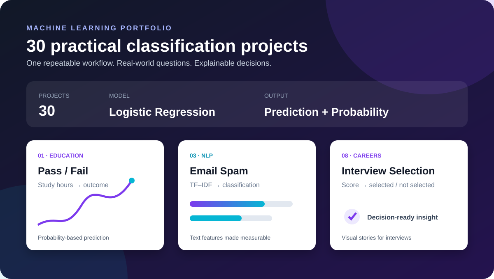

# Logistic Regression: 30 Practical Projects

<div align="center">

[](https://www.python.org/)
[](https://scikit-learn.org/)
[](https://jupyter.org/)
[](#project-highlights)
[](LICENSE)



### A practical AI/ML portfolio built for measurable, explainable decisions

I’m **Ashka Singh**, an aspiring AI/ML professional building hands-on solutions with Python, data analysis, and machine learning. This repository demonstrates how I take a business question, prepare data, train a model, evaluate it, and communicate the result visually.

[Explore the notebook](./logistic_regression_30_Practical_.ipynb) · [Run in Colab](https://colab.research.google.com/github/sgsinghashka-del/Logistic-Regression_30-Practical-Projects/blob/main/logistic_regression_30_Practical_.ipynb) · [View the interview slide](./assets/interview-one-slide.svg)

</div>

---

## About me — interview introduction

> “I’m an aspiring AI/ML engineer who enjoys turning raw data into clear, useful predictions. In this project, I applied logistic regression to 30 practical binary-classification problems—from pass/fail and employee attrition to spam detection and customer behavior. My focus was not only training models, but also understanding the complete workflow: feature preparation, target encoding, evaluation, visualization, and communicating limitations. I’m now looking to apply this foundation to production-quality projects involving stronger validation, responsible AI, and deployment.”

### Core skills demonstrated

- **Programming:** Python, pandas, NumPy, Jupyter Notebook
- **Machine learning:** Logistic regression, binary classification, train/test splitting, probability estimates
- **NLP:** TF–IDF vectorization for email spam detection
- **Evaluation:** Accuracy, precision, recall, F1-score, classification reports
- **Visualization:** Matplotlib, decision-oriented charts, probability plots
- **Engineering mindset:** Reproducible setup, clear documentation, modular improvement roadmap

## Why this project stands out

This is more than a single model: it is a repeatable classification workflow applied to **30 practical scenarios**. Each mini-project follows the same professional pattern:

1. Load and inspect a focused dataset.
2. Prepare features and encode the target label.
3. Train a `LogisticRegression` model.
4. Evaluate predictions with accuracy and a classification report.
5. Visualize the decision context.
6. Test a new, user-provided example.

The result is a compact portfolio that is easy to explain in an interview and easy to extend with better datasets, validation, and deployment.

## Project highlights

| # | Business question | Main feature | Output |
|---:|---|---|---|
| 01 | Will a student pass? | Study hours | Pass / Fail + probability |
| 02 | May an employee leave? | Years in company | Stay / Leave |
| 03 | Is an email spam? | Email text | Spam / Not spam |
| 04 | Will a visitor purchase? | Time spent | Purchase / No purchase |
| 05 | Is an employee promotion-ready? | Years of experience | Promoted / Not promoted |
| 06 | Is an employee likely to be absent? | Previous absences | Absent / Present |
| 07 | Will a product be returned? | Days used | Returned / Not returned |
| 08 | Will a candidate be selected? | Interview score | Selected / Not selected |
| 09 | Will an offer be accepted? | Offered salary | Accepted / Rejected |
| 10–30 | Additional practical classification problems | Structured and text features | Binary predictions |

> The notebook is the source of truth for the complete set of 30 exercises and their datasets.

## Visual portfolio map

| Area | Examples | Techniques demonstrated |
|---|---|---|
| **People & careers** | Attrition, promotion, absenteeism, selection | Numeric features, label mapping, probability estimates |
| **Customer behavior** | Purchase, returns, offer acceptance | Decision boundaries, exploratory plots, predictions |
| **Communication** | Email spam detection | TF–IDF vectorization + logistic regression |
| **Education** | Pass/fail prediction | Train/test split, metrics, interactive inference |

## Quick start

```bash
git clone https://github.com/sgsinghashka-del/Logistic-Regression_30-Practical-Projects.git
cd Logistic-Regression_30-Practical-Projects
python -m venv .venv

# macOS/Linux
source .venv/bin/activate

# Windows PowerShell
.venv\Scripts\Activate.ps1

pip install -r requirements.txt
jupyter notebook logistic_regression_30_Practical_.ipynb
```

Or open the notebook directly in Google Colab using the link above.

## Example workflow

```python
from sklearn.linear_model import LogisticRegression
from sklearn.model_selection import train_test_split
from sklearn.metrics import accuracy_score, classification_report

X_train, X_test, y_train, y_test = train_test_split(
    X, y, test_size=0.2, random_state=42, stratify=y
)

model = LogisticRegression()
model.fit(X_train, y_train)

predictions = model.predict(X_test)
print(f"Accuracy: {accuracy_score(y_test, predictions):.2%}")
print(classification_report(y_test, predictions))
```

For text classification, the notebook adds a `TfidfVectorizer` before fitting the model so that email language can be represented numerically.

## One-slide interview presentation


A presentation-ready version is also available as a speaker-notes document: [docs/INTERVIEW_SLIDE.md](./docs/INTERVIEW_SLIDE.md).

## What to discuss in an interview

- **Why logistic regression?** It is fast, interpretable, and naturally provides class probabilities for binary decisions.
- **What does the probability mean?** It is the model's estimated likelihood for the positive class—not a guarantee.
- **Why split the data?** To evaluate how the model performs on examples it did not train on.
- **What would you improve?** Add cross-validation, stronger datasets, feature scaling where appropriate, threshold tuning, confusion matrices, ROC-AUC, and a reproducible pipeline.
- **What is the main limitation?** Results are only as reliable as the small teaching datasets and selected features; they should not be used for high-impact decisions without deeper validation.

## Repository structure

```text
.
├── logistic_regression_30_Practical_.ipynb  # Main portfolio notebook
├── assets/
│   ├── project-preview.svg                  # Premium README banner
│   └── interview-one-slide.svg              # PowerPoint-style visual slide
├── docs/
│   └── INTERVIEW_SLIDE.md                   # Slide content and speaker notes
├── PROFILE_README.md                         # GitHub profile README template
├── requirements.txt                          # Reproducible dependencies
├── .gitignore                                # Clean Python/Jupyter defaults
├── LICENSE                                   # MIT license
└── README.md                                 # Project guide and interview story
```

## Roadmap

- [ ] Add documented schemas for every exercise.
- [ ] Refactor repeated code into reusable training/evaluation functions.
- [ ] Add confusion matrices and ROC-AUC to each classification task.
- [ ] Add cross-validation and a reproducible random seed strategy.
- [ ] Publish a lightweight Streamlit demo.
- [ ] Add automated notebook execution with GitHub Actions.

## Responsible use

These examples are educational demonstrations. The datasets are small and should not be treated as production-ready evidence, especially for employment, education, or other high-impact decisions. Validate models on representative data, inspect errors, and assess fairness before real-world use.

## License

Distributed under the MIT License. See [LICENSE](./LICENSE).

<div align="center"><strong>Built as a practical machine-learning learning portfolio.</strong></div>
