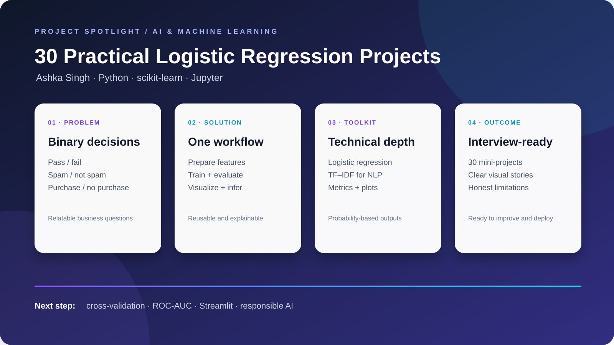

# One-slide interview presentation

## 30 Practical Logistic Regression Projects

**Candidate:** Ashka Singh  
**Role focus:** AI/ML · Data Science · Python Development

### Problem
Many business and everyday questions are binary: pass or fail, spam or not spam, purchase or no purchase, selected or not selected. The goal was to build a portfolio that demonstrates this pattern across varied domains.

### Solution
Created a Jupyter Notebook containing 30 practical classification exercises using Python and scikit-learn. Each exercise follows a repeatable workflow: prepare data, encode labels, train logistic regression, evaluate predictions, visualize the result, and test a new example.

### Technical highlights

- Logistic regression for interpretable binary classification
- pandas and NumPy for data preparation
- TF–IDF for the email spam NLP use case
- Accuracy, precision, recall, F1-score, and classification reports
- Matplotlib visualizations and probability-based outputs

### Outcome
A compact, explainable portfolio that connects machine-learning concepts to relatable business scenarios and clearly communicates both model outputs and limitations.

### Next step
Productionize the workflow with reusable pipelines, cross-validation, ROC-AUC, stronger datasets, a Streamlit interface, and automated notebook testing.

## 30-second speaking script

“I built this portfolio to show that I understand more than fitting one model. Across 30 binary-classification problems, I repeatedly apply the full workflow: data preparation, model training, evaluation, visualization, and inference. Logistic regression was a good baseline because it is fast and interpretable, while its probabilities make the results easy to explain. The next step is to improve validation and package the best examples into a deployable application.”
